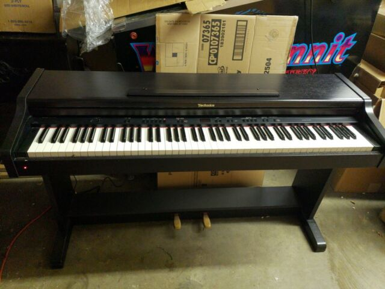
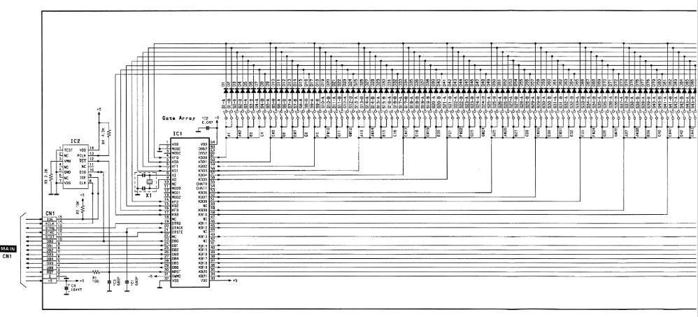
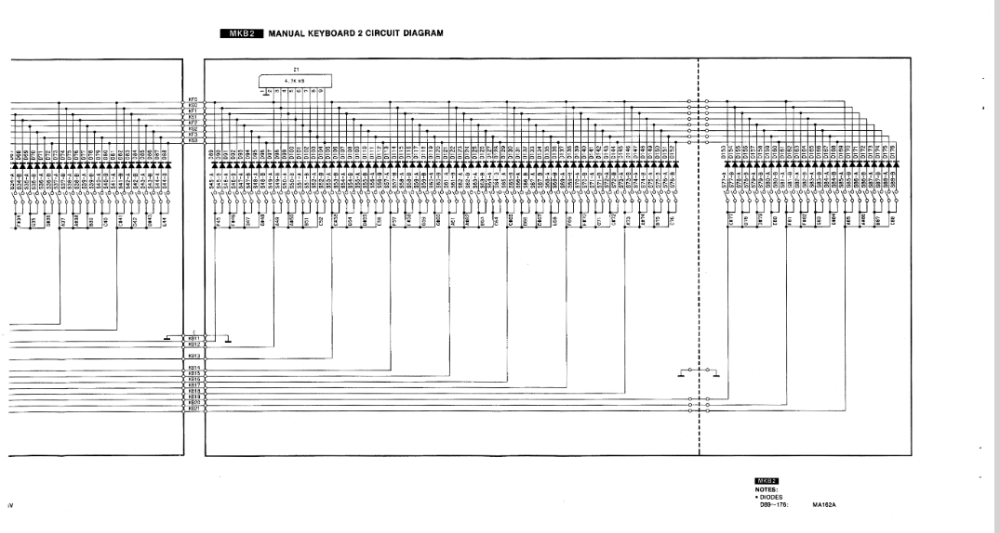
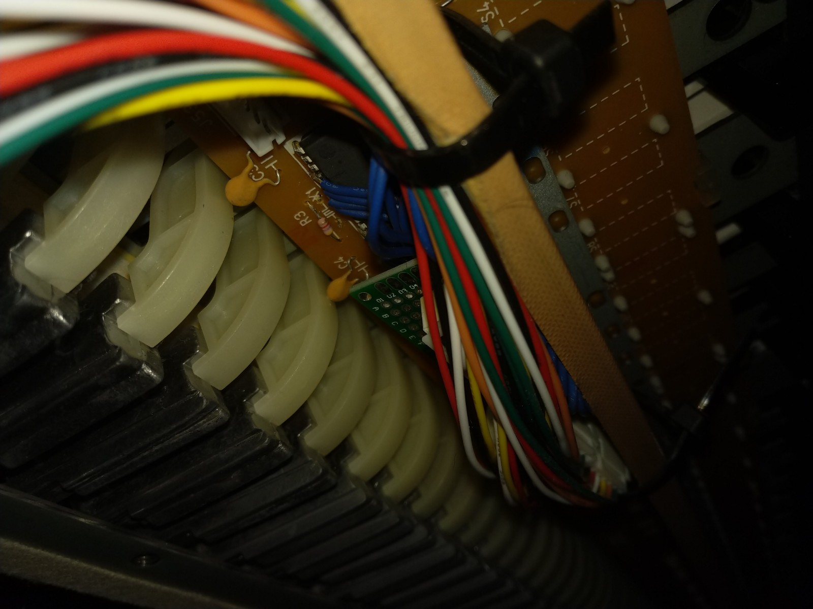
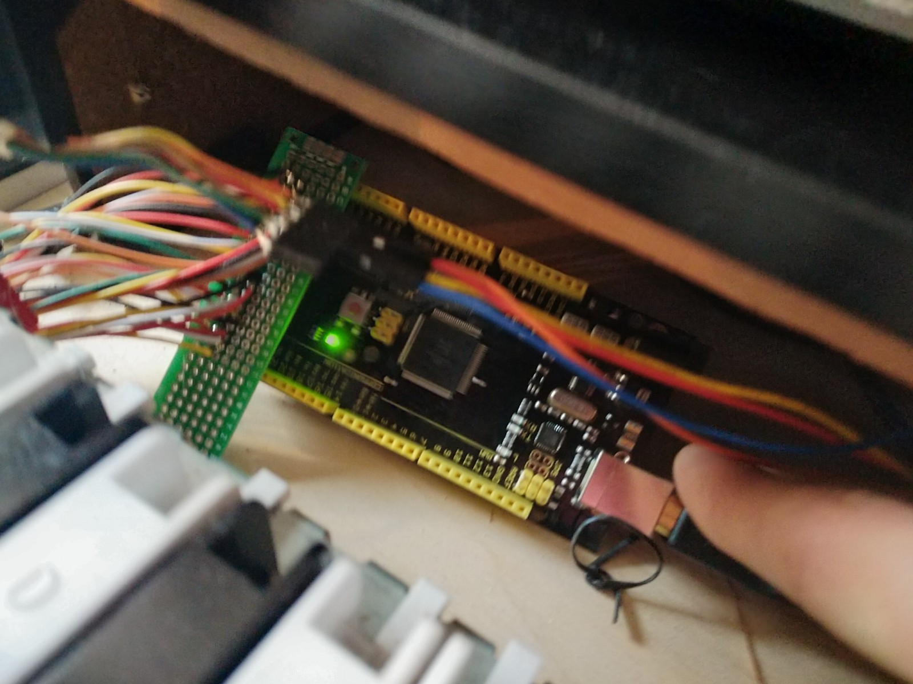

# usb-midi-keyboard

### Broken Technics Electric Piano $20 off Kijiji

I bought it with the intention to fix it. Powered on but nothing worked no sound or display. Isolated the issue to one of the ICs on the main control board. Parts to fix would have been more than I paid for it so I decided to see if I could make something useful from it.

### Found Service Manual Online

There are 88 keys on this keyboard each key has 2 switches for a total of 176 individual switches. One triggers slightly before the other in order to sense the velocity of the keypress. The switches are layed out in a 22x8 key matrix (22 groups of 4 keys with 2 switches each). 

#### I soldered onto the 30 points at the IC labeled IC1 in the schematic that corresponded to the columns and rows of the keymatrix.

### Arduino Mega 

Since this was a weekend project I used an arduino mega as the microcontroller for this. Eventually I want to switch it out to use something less overkill. There is also a great project that provides firmware you can flash to your arduino to allow Native USB-MIDI called HIDUINO.

